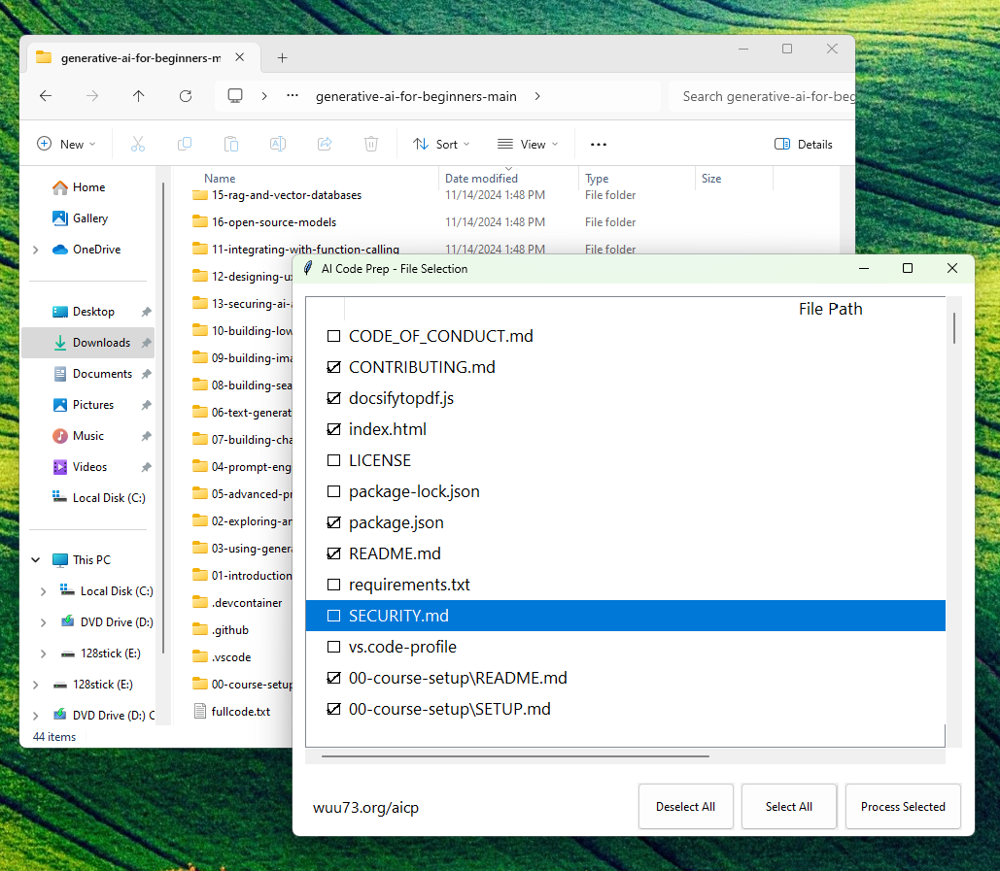
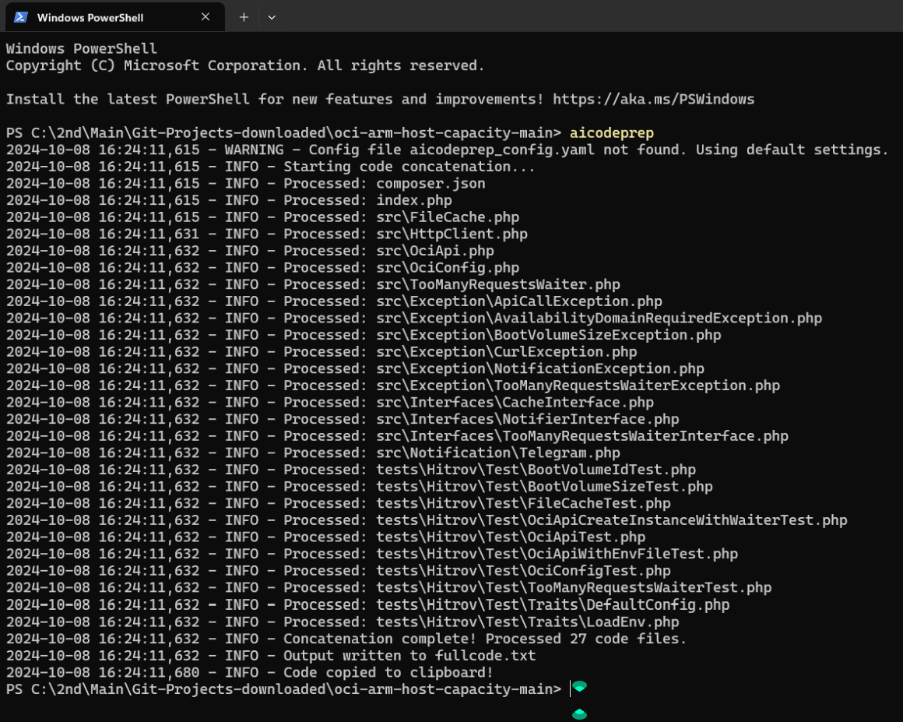

# aicodeprep-GUI version here: https://wuu73.org/aicp/

GUI version for Windows and Mac, installers are available on the other repository called aicodeprep-gui-c. Run installer to install the right click menu/app.

Compiled Mac version only tested on my M1 Macbook, will work on getting it to work uncompiled (i am still learning how Mac OS does things).

# aicodeprep (AI Code Prep free / open source command line version)

aicodeprep is a command-line tool designed to simplify the process of sharing your project's code with AI chatbots. It recursively scans your project directory, concatenates all code files into a single text file, and copies the content to your clipboard for easy pasting into a LLM chat.

## Purpose

The primary purpose of aicodeprep is to save time when you need to ask AI chatbots questions about your development project. Instead of manually copying and pasting multiple files, aicodeprep automates the process of gathering all your project's code into a single, easily shareable format.

## Windows Installation

You can install aicodeprep directly from PyPI:

pip install aicodeprep

## Linux Installation (Debian / Ubuntu / Mint)

pip install --user aicodeprep

sudo apt-get install xclip

echo 'export PATH="$PATH:$HOME/.local/bin"' >> ~/.bashrc

source ~/.bashrc

## Linux Installation (Fedora)

pip install --user aicodeprep

sudo dnf install xclip

echo 'export PATH="$PATH:$HOME/.local/bin"' >> ~/.bashrc

source ~/.bashrc

**_xclip is needed in Linux for the clipboard functionality_**

## Usage

After installation, you can run aicodeprep from any directory containing your project files and folders:

aicodeprep

This will create a file named `fullcode.txt` in the current directory and copy its contents to your clipboard.

### Options

- `-n, --no-copy`: Do NOT copy output to clipboard (default behavior is to copy)
- `-o FILENAME, --output FILENAME`: Specify the output file name (default: fullcode.txt)

Example:

aicodeprep -n -o my_project_code.txt

This will create `my_project_code.txt` without copying to clipboard.

## Configuration

You can customize aicodeprep's behavior by creating a `aicodeprep_config.yaml` file in your project directory. Here's an example:

code_extensions:

- .py
- .js
- .html
  exclude_dirs:
- node_modules
- venv
  max_file_size: 500000 # in bytes

Contributions are welcome! Please feel free to submit a Pull Request.
https://github.com/detroittommy879

Donations/Tip welcome! It helps motivate me to try and make cooler tools!

https://wuu73.org/hello.html

Tips: https://ko-fi.com/detroittommy879

Bitcoin: bc1qkuwhujaxhzk7e3g4f3vekpzjad2rwlh9usagy6

Litecoin: ltc1q3z327a3ea22mlhtawmdjxmwn69n65a32fek2s4

Monero: 46FzbFckBy9bbExzwAifMPBheYFb37k8ghGWSHqc6wE1BiEz6rQc2f665JmqUdtv1baRmuUEcDoJ2dpqY6Msa3uCKArszQZ

Cashapp: $lightweb73

License

This project is licensed under the MIT License.
